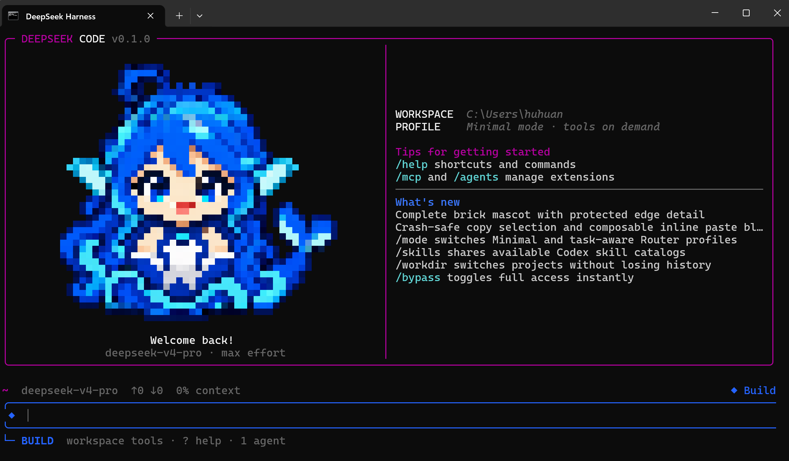

# DeepSeek Code TUI

[](https://github.com/BenHuHuan/dhscode-tui/releases) [](#platform-support) [](LICENSE)

English | [中文](README.zh.md)

<p align="center">
  
</p>

**DeepSeek Code TUI v0.1.0** is a terminal-native coding agent built on the official [DeepSeek Harness](https://github.com/deepseek-ai/deepseek-harness). It keeps Harness's Cordis plugin architecture and adds an opinionated, Claude-Code-style workflow for DeepSeek V4 Pro/Flash on Windows, Linux, servers, and SSH sessions.

Enter `deepseek` in a project to get a persistent coding workspace with a compact first prompt, tools on demand, permission modes, MCP visibility, continuable agents, checkpoints, and a TUI that does not require a browser.

> Independent community distribution; not an official DeepSeek product and not affiliated with Anthropic. Claude Code is referenced only as a UX comparison.

## v0.1.0 highlights

- **One-command TUI:** bare `deepseek` or `dsh` opens the current directory.
- **DeepSeek-first defaults:** V4 Pro, max reasoning effort, and a minimal first request that promotes the full coding tool catalog on demand.
- **Windows + Linux:** native PowerShell support, Git Bash preference in Windows bypass mode, and Bash on Linux/server environments.
- **Persistent authentication:** `/login` securely saves or replaces the DeepSeek API token.
- **Visible work modes:** Build, Flow, Inspect, and Blueprint/Plan each have distinct colors, prompt glyphs, permissions, and footer state.
- **Permission control:** `/bypass` and `--dangerously-skip-permissions` enable full access without preconfiguring an environment variable.
- **Coding workflow:** file reads/search/edits, shell execution, background jobs, task lists, context compaction, model selection, and reasoning control.
- **Durable sessions:** resume, continue, rename, clear, export, and history search.
- **Workspace safety:** interactive diff, named checkpoints, and rewind/fork.
- **MCP and agents:** inspect/reload MCP and manage durable subagents in the TUI.
- **Skills:** discover skill catalogs and invoke `/skill:<name>`.
- **Terminal media:** clipboard-image input and inline rendering, with an ANSI pixel fallback for Windows Terminal.
- **Polished interaction:** mouse scrolling, jump-to-bottom, blue selection, OSC 52 copy, width-safe rendering, and composable multiline paste blocks.

## Requirements

- Node.js `22.19+` or `24+` (Node 24 recommended)
- pnpm `11.7+`
- Git and a DeepSeek API key
- A modern terminal such as Windows Terminal, WezTerm, Kitty, or iTerm2
- Optional on Windows: Git for Windows for the Linux-like Bash tool

<a id="run"></a><a id="run-from-source"></a>

## Install from source

v0.1.0 is currently distributed from source:

```bash
git clone https://github.com/BenHuHuan/dhscode-tui.git
cd dhscode-tui
corepack enable
pnpm install
pnpm run build:lib:host
pnpm --filter @deepseek-ai/dsh link --global
```

Open a new terminal, enter a project, and launch:

```bash
cd your-project
deepseek
```

Without a global link:

```bash
pnpm --dir /path/to/dhscode-tui deepseek
```

Repository-local Windows entry:

```powershell
node .\apps\cli\lib\bin.js
```

## First run

1. Start `deepseek` in the project directory.
2. Run `/login` and paste a DeepSeek API key. The local credential provider persists it for later sessions.
3. Run `/model` to confirm or switch the model.
4. Enter a coding request and press Enter.
5. Press Shift+Tab to cycle work modes, or use `/permission` and `/plan`.

One-off unrestricted launch:

```bash
deepseek --dangerously-skip-permissions
```

Use bypass only in a trusted workspace: it permits shell commands and file changes without approval prompts.

## Minimal-first bootstrap

The standard agent begins with a small stable prompt and minimal catalog (`shell` + `read`). After the first durable tool call or assistant reply, the complete coding catalog becomes available. This keeps the initial request near the official DeepSeek Harness minimal-mode shape while preserving a full coding agent for the rest of the session.

The default effort is max. DeepSeek profiles support sampling values such as `temperature=1.0` and `top_p=0.95`. Prompt anchoring improves consistency, but cannot guarantee a particular hidden chain-of-thought prefix.

## Main commands

| Command | Purpose |
| --- | --- |
| `/login` | Persist or replace the DeepSeek API token |
| `/model`, `/effort` | Select the model and reasoning effort |
| `/permission`, `/bypass`, `/plan` | Control safety and work mode |
| `/workdir [path]` | Open another project in a fresh session |
| `/diff` | Review uncommitted workspace changes |
| `/checkpoint [label]` | Save a reversible workspace/conversation point |
| `/rewind` | Restore a checkpoint and optionally branch the conversation |
| `/resume`, `/continue` | Resume a persisted session |
| `/new`, `/clear` | Start fresh while preserving the previous session |
| `/compact`, `/context` | Manage and inspect context pressure |
| `/agents` | List and manage durable continuable subagents |
| `/mcp` | Show MCP connection state and public tools |
| `/skills`, `/skill:<name>` | Discover and load skills |
| `/tasks` | Inspect background and delegated tasks |
| `/copy`, `/export` | Copy a response or export the conversation |
| `/config`, `/status`, `/help` | Settings, diagnostics, and documentation |

Type `/` for scrollable command completion. Skill commands load asynchronously from active catalogs.

## Keyboard essentials

- Enter sends; Shift+Enter or Alt+Enter inserts a newline.
- Shift+Tab cycles work modes; Alt+P selects a model; Alt+T toggles thinking.
- Ctrl+V or Alt+V pastes a clipboard image when available.
- Long/multiline text appears as compact `[Paste #N ...]` blocks; normal text can be composed before, between, and after multiple blocks.
- Mouse wheel scrolls; Ctrl+End jumps to the latest output.
- Ctrl+O cycles tool-card detail; Ctrl+R searches history.
- Ctrl+S stashes/restores a draft; Ctrl+G opens the external editor.
- `! command` streams a shell command and offers its result to the model.
- Ctrl+C cancels/clears; press twice on empty input to exit.

## Platform support

### Windows

Windows Terminal + PowerShell is the primary v0.1.0 desktop target. Sandboxed modes use PowerShell. With bypass enabled, DeepSeek Code can prefer Git Bash at the standard Git for Windows location for a more Linux-like tool environment.

```powershell
$env:DSH_BASH_PATH = 'C:\Program Files\Git\bin\bash.exe'
deepseek
```

### Linux and servers

Run the same `deepseek` command in Bash-compatible terminals and SSH sessions. Inline bitmap support depends on the terminal; ANSI pixels and text metadata remain available as fallbacks.

## Data and security

- Sessions and credentials remain local under the configured DSH home.
- API keys are not printed by `/status` or normal logs.
- Workspace Write is the normal editing mode; Inspect and Plan reduce mutation authority; bypass removes approval prompts.
- Use `/checkpoint` before broad refactors. Rewind is not a replacement for Git commits or backups.
- Never grant unrestricted access to an untrusted repository.

## Architecture

DeepSeek Code remains a DeepSeek Harness distribution, not a monolithic CLI. Cordis plugins provide the model route, tools, sessions, permissions, credentials, MCP, skills, agents, and UI. Optional capabilities degrade independently when their service is not mounted.

- [TUI subsystem](docs/subsystems/tui.md)
- [MCP subsystem](docs/subsystems/mcp.md)
- [Architecture](docs/architecture.md)
- [Development guide](docs/development.md)
- [Testing](docs/testing.md)

## Known v0.1.0 limitations

- Source release only; no npm, MSI, Homebrew, or standalone binary yet.
- Terminals differ in mouse reporting, OSC 52 clipboard, and image protocols.
- MCP and agents have functional commands, not graphical marketplaces.
- Checkpoints support the local workflow but are not transactional storage.
- Compatibility-breaking configuration changes may occur before v1.0.

## Development

```bash
pnpm install
pnpm run build:lib:host
pnpm run test
pnpm run test:e2e
```

Keyless E2E fixtures need no API key; real model calls do. Report bugs through [GitHub Issues](https://github.com/BenHuHuan/dhscode-tui/issues) with the OS, terminal, Node version, launch command, and smallest reproduction.

## Release status

**v0.1.0 — first public release.** The terminal coding loop is usable for early adopters; APIs and configuration remain pre-1.0.

## License

[MIT](LICENSE). See [THIRD_PARTY_NOTICES.md](THIRD_PARTY_NOTICES.md).
