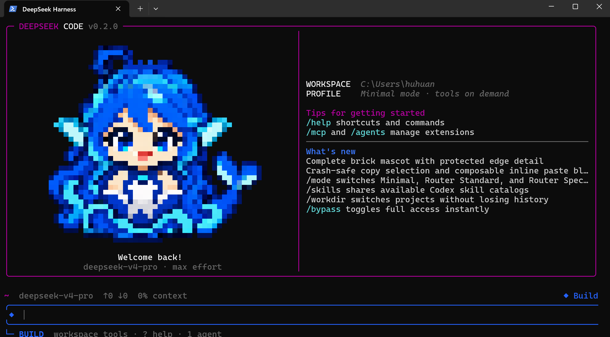

# DeepSeek Code TUI

[](https://github.com/BenHuHuan/dhs-tuicode/tree/v0.3.0) [](https://github.com/BenHuHuan/dhs-tuicode) [](LICENSE)

English | [中文](README.zh.md)

<p align="center">
  
</p>

**DeepSeek Code TUI** is a terminal-native coding agent built on the official [DeepSeek Harness](https://github.com/deepseek-ai/deepseek-harness). It combines DeepSeek V4 Pro/Flash, a persistent TUI, real coding tools, resumable sessions, permissions, MCP, skills, and continuable subagents in one shell-first workflow.

Run `deepseek` inside a project. No browser is required.

> This is an independent community distribution. It is not an official DeepSeek product and is not affiliated with Anthropic. Claude Code is referenced only as a terminal UX comparison.

## Why this build

- **DeepSeek-native defaults:** V4 Pro, max reasoning effort, and a Minimal first request that reveals the complete coding tool catalog on demand. The catalog also includes the vision-capable `deepseek-v4-flash-vision-exp` model for image input.
- **Real Bash semantics on Windows:** model-facing shell calls use Git Bash/MSYS instead of pretending PowerShell is Bash; safe Windows operations can still use PowerShell.
- **A complete terminal loop:** inspect, search, edit, run commands, review diffs, create checkpoints, rewind, resume, export, and manage long-running work without leaving the TUI.
- **Explicit safety states:** permission and planning modes have distinct colors, prompt rails, glyphs, and footer labels; unrestricted access is always an explicit choice.
- **Extensible by design:** MCP servers, skills, durable subagents, and the `allin` multi-agent tool use the underlying Cordis plugin architecture rather than a separate wrapper runtime.
- **Windows-friendly interaction:** CJK-aware layout, mouse scrolling, jump-to-bottom, selection copy, multiline paste blocks, clipboard images, and width-safe rendering.

## v0.3.0 highlights

- **Vision prompts:** select `deepseek-v4-flash-vision-exp` with `/model` to send text, clipboard images, or both in one prompt.
- **Reliable Windows image paste:** Alt+V reads native PNG bytes, bitmap clipboard objects, and copied image files; Ctrl+V also works when the terminal forwards that chord to the TUI.
- **Composable drafts:** image markers stay in place beside ordinary text and multiline paste blocks, while text-only bracketed paste replays unchanged.
- **Safe admission:** image bytes remain draft-local until send, and text-only model routes reject image prompts before attachment persistence.

<a id="run"></a>

## Quick start

### Requirements

- Node.js `22.19+` or `24+` (Node 24 recommended)
- pnpm `11.7+`
- Git and a DeepSeek API key
- Windows Terminal, WezTerm, Kitty, iTerm2, or another modern terminal
- Git for Windows when using the Bash-backed profiles on Windows

<a id="run-from-source"></a>

### Install from source

The current source line is **v0.3.0**. Packaged installers and npm releases are not available yet.

```bash
git clone https://github.com/BenHuHuan/dhs-tuicode.git
cd dhs-tuicode
corepack enable
pnpm install
pnpm run build:lib:host
pnpm --filter @deepseek-ai/dsh link --global
```

Open a new terminal, enter a project, and run:

```bash
cd your-project
deepseek
```

To run directly from a checkout without the global link:

```bash
pnpm --dir /path/to/dhs-tuicode dsh
```

On Windows, the built repository-local entry is:

```powershell
node .\apps\cli\lib\bin.js
```

### First session

1. Run `deepseek` in the directory you want the agent to edit.
2. Enter `/login` and paste the DeepSeek API key. The credential provider saves it for later sessions.
3. Use `/model` to confirm or change the model.
4. Enter a coding request and press Enter.
5. Press Shift+Tab to change the active permission/planning state.

For a one-off unrestricted launch:

```bash
deepseek --dangerously-skip-permissions
```

Only use bypass in a trusted workspace. It removes approval prompts for shell commands and file changes.

## Two independent mode systems

DeepSeek Code deliberately separates **model/tool routing** from **workspace permissions**. Changing one does not silently change the other.

### Routing profiles: `/mode`

| Profile | Intended model | First-request behavior |
| --- | --- | --- |
| `minimal` | V4 Pro (default) | Starts with the anchored Minimal prompt and a small `shell` + `read` surface, then promotes the full catalog after the first durable action or assistant result |
| `router` | Primarily V4 Flash | Restores the routing suite's compact RL interface with a one-sentence persona and shell/editor surface, then opens the full catalog after the first tool call |
| `spec` | Primarily V4 Flash | Uses task classification, deep-think-first guidance, and the spec/react/weak first-turn tool surface for more deliberate planning |

The Router profiles port reproducible behavior from [dsh-routing-suite](https://github.com/yjh051108/dsh-routing-suite), including chat stand-down, fresh classification for later tasks, complexity-aware guidance, and a non-Flash-only closure suffix. Minimal follows the anchored approach from [dsh-anchored-standard](https://github.com/xiaobright/dsh-anchored-standard).

The default reasoning effort is max. Prompt and shell anchoring can improve behavioral consistency, but they do not guarantee a fixed hidden reasoning prefix.

Switch at any time:

```text
/mode minimal
/mode router
/mode spec
```

### Permission and planning states

Shift+Tab cycles the configured safe states and Plan. The bundled theme presents states such as Build, Flow, Inspect, and Plan with different color systems and authority. Use `/permission`, `/plan`, and `/bypass` for direct control.

Dangerous full access is never added to the normal cycle until it has been selected explicitly.

## What is included

| Area | Capabilities |
| --- | --- |
| Coding | File read/search/edit, shell execution, background jobs, task lists, tool cards, external editor, and direct `! command` execution |
| Sessions | Persistent logs, resume/continue, rename, clear/new, prompt history, context compaction, copy, and export |
| Review and recovery | Interactive diff, named workspace/conversation checkpoints, rewind, and conversation branching |
| Models | Provider/model selection, reasoning effort, thinking visibility, token usage, vision image input, image token estimation, and context pressure |
| Extensions | MCP status/reload, skill discovery and invocation, durable subagent management, and Cordis plugins |
| Multi-agent | `allin` orchestration with a V4 Pro coordinator and parallel V4 Flash execution lanes |
| Terminal UX | Mouse scrolling, jump-to-bottom, OSC 52 selection copy, inline paste blocks, clipboard-image input, terminal images, ANSI pixel fallback, and CJK-aware width handling |

## Main commands

| Command | Purpose |
| --- | --- |
| `/login` | Save or replace the DeepSeek API token |
| `/model`, `/effort` | Select the model and reasoning effort |
| `/mode` | Switch Minimal, Router, or Spec model/tool routing |
| `/permission`, `/plan`, `/bypass` | Control workspace authority and planning state |
| `/workdir [path]` | Open another project in a fresh session |
| `/diff` | Review uncommitted workspace changes |
| `/checkpoint [label]`, `/rewind` | Create and restore reversible workspace/conversation points |
| `/resume`, `/continue` | Resume a persisted session |
| `/new`, `/clear`, `/rename` | Manage conversation identity and lifecycle |
| `/compact`, `/context` | Manage and inspect context pressure |
| `/agents`, `/tasks` | Manage continuable subagents and background work |
| `/mcp` | Show MCP connection state and public tools |
| `/skills`, `/skill:<name>` | Discover and load skills |
| `/copy [N]`, `/export [file]` | Copy assistant output or export the conversation |
| `/config`, `/status`, `/help` | Edit settings, inspect diagnostics, and open help |

Type `/` to open the scrollable command palette. Skill commands are populated asynchronously from active catalogs.

## Keyboard essentials

- Enter sends; Shift+Enter or Alt+Enter inserts a newline.
- Shift+Tab changes the permission/planning state; Alt+P chooses a model; Alt+T toggles thinking.
- Up/Down browses prompt history; Ctrl+R searches it.
- Alt+V pastes a clipboard image on Windows; Ctrl+V also works when the terminal forwards that chord to the TUI.
- Long or multiline text becomes a compact `[Paste #N ...]` block that can be combined with ordinary text and additional blocks.
- The mouse wheel scrolls the transcript; Ctrl+End jumps to the latest output.
- Ctrl+O cycles tool-card detail; Ctrl+T toggles the task checklist.
- Ctrl+S stashes or restores the current draft; Ctrl+G opens an external editor.
- Ctrl+C cancels or clears; press it twice on empty input to exit.
- Type `?` on empty input for the complete shortcut reference.

## Windows Git Bash integration

On Windows, Minimal and Router model-facing shell tools launch fresh Git Bash processes with real Bash/MSYS command semantics. DeepSeek Code checks `DSH_BASH_PATH`, `GIT_BASH`, standard Git for Windows locations, and finally `PATH`. PowerShell remains available for Windows-confined operations.

Because MSYS signal pipes do not work inside the restricted-token sandbox used by safe Windows execution, a Git Bash tool call may require one full-access approval or `/bypass on`. This is a Windows runtime constraint, not an API-key requirement.

Override Bash discovery when needed:

```powershell
$env:DSH_BASH_PATH = 'C:\Program Files\Git\bin\bash.exe'
deepseek
```

For mixed Chinese and English, select **Sarasa Mono SC** or another verified CJK monospace font in the terminal profile. Proportional CJK fallback fonts can appear misaligned even when the TUI's column calculations are correct.

## Linux, servers, and SSH

Run the same `deepseek` command in a Bash-compatible terminal. The coding loop, sessions, permissions, MCP, skills, and subagents do not require a desktop. Bitmap image protocols depend on the terminal; ANSI pixels and text metadata remain available as fallbacks.

## Local data and security

- Sessions, configuration, and managed credentials are stored under the configured DSH home directory.
- `/status` and normal logs do not print the saved API key.
- Workspace Write is the normal editing authority; Inspect and Plan reduce mutation authority; bypass removes approval prompts.
- Use `/checkpoint` before broad refactors, but keep using Git and backups: rewind is not transactional storage.
- Do not grant unrestricted access to an untrusted repository.

## Architecture and extension points

DeepSeek Code remains a DeepSeek Harness distribution rather than a monolithic wrapper. Cordis plugins provide model routes, tools, sessions, permissions, credentials, MCP, skills, agents, and the TUI. Optional capabilities can be added or removed without replacing the core agent loop.

- [Architecture](docs/architecture.md)
- [TUI subsystem](docs/subsystems/tui.md)
- [MCP subsystem](docs/subsystems/mcp.md)
- [Skills subsystem](docs/subsystems/skills.md)
- [Development guide](docs/development.md)
- [Testing guide](docs/testing.md)

## Current limitations

- Installation is source-based; there is no npm, MSI, Homebrew, or standalone binary release yet.
- Mouse reporting, OSC 52 clipboard support, color, fonts, and image protocols vary by terminal.
- MCP, skills, and agents have functional terminal management surfaces rather than graphical marketplaces.
- Checkpoints support local coding recovery but do not replace commits, worktrees, or backups.
- Configuration and compatibility may change before v1.0.

## Development

```bash
pnpm install
pnpm run build:lib:host
pnpm run test
pnpm run test:e2e
```

Keyless e2e fixtures do not require an API key; real model requests do. Report bugs through [GitHub Issues](https://github.com/BenHuHuan/dhs-tuicode/issues) with the OS, terminal, Node version, launch command, and smallest reproduction.

## Project status

The repository and source tag are currently **v0.3.0**. This is a pre-1.0 community distribution intended for early adopters and contributors.

DeepSeek Harness and the imported routing/minimal projects retain their own history, authorship, and notices. GitHub's contributor list is derived automatically from commit history; it is not an ownership declaration by this README.

## License

[MIT](LICENSE). See [THIRD_PARTY_NOTICES.md](THIRD_PARTY_NOTICES.md) for bundled third-party notices.
